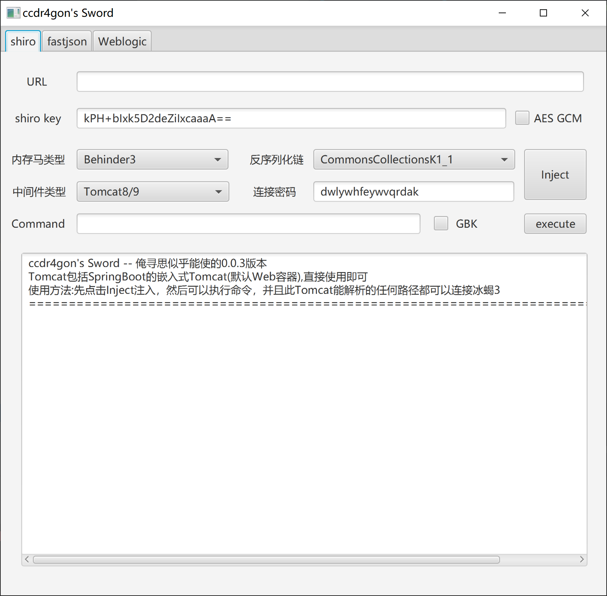
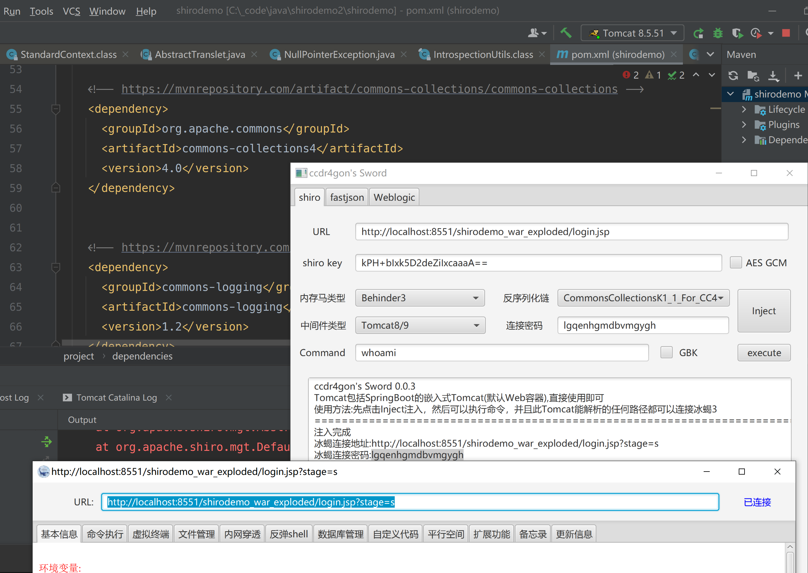

# Dr4gonSword

**仅供交流学习漏洞原理,请勿用于非法用途**

- [Shiro](#shiro)
  + [使用方法](#----)
  + [利用链](#---)
  + [内存马和回显方法](#--------)
  + [本地测试过的中间件版本](#-----------)

- [更新记录](#----)
  * [0.0.4](#004)
  * [0.0.3](#003)
  * [0.0.2](#002)
- [未来更新(可能)](#--------)
- [感谢](#--)

**仅供交流学习漏洞原理,请勿用于非法用途**

版本0.0.4

不干红队多年，archived

## Shiro

### 使用方法

点击Inject进行注入,然后才能连接冰蝎或者执行命令

连接冰蝎的时候加get参数stage=s

### 本地测试过的中间件版本

Tomcat 7.0.109 √

Tomcat 8.5.51 √

Tomcat 9.0.46 √

Springboot 2.3.5 √  <tomcat.version>9.0.39</tomcat.version> 

Springboot 2.0.5 √ <tomcat.version>8.5.51</tomcat.version>

Springboot 2.0.5 √ <tomcat.version>8.5.51</tomcat.version> shiro version 1.7.0 (gcm)

Tomcat 8.5.51 √ with commons-collections4 dependency

# 感谢

phithon

kingkk

j1anFen

Litch1

threedr3am

李三

LandGrey

Lucifaer

c0ny1

等等师傅们

